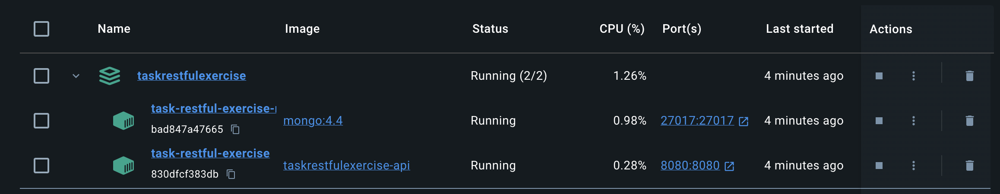

# Task Restful Exercise

Implement a RESTful task API application by `golang` and `gin`


[](https://drive.google.com/file/d/1l5SuhgK_TNOP44ltzwZLiRym5UT2nsJk/view?usp=sharing)
Video: https://drive.google.com/file/d/1l5SuhgK_TNOP44ltzwZLiRym5UT2nsJk/view?usp=sharing

## Start Server

```sh
# by makefile
make run

# by docker-compose
docker-compose up --build
```



## Local test
```sh
air -c air.toml http --port 5566
```

## API Doc
Please refer [docs/api.md](./docs/api.md)


## Information
### MongoDB 
Initializing mongo db in docker-compose with init script.
Path : `data/mongo-init.js`

#### Root Account

* Account: `root`
* Password: `root`

#### User Account

* Account: `user`
* Password: `user_password`

## Reference
* [HTTP/Status](https://developer.mozilla.org/en-US/docs/Web/HTTP/Status)
* [Initializing mongo db in docker-compose with init script](https://gist.github.com/gbzarelli/c15b607d62fc98ae436564bf8129ea8e)
* [config: spf13/viper](https://github.com/spf13/viper)
* [cosmtrek/air](https://github.com/cosmtrek/air)